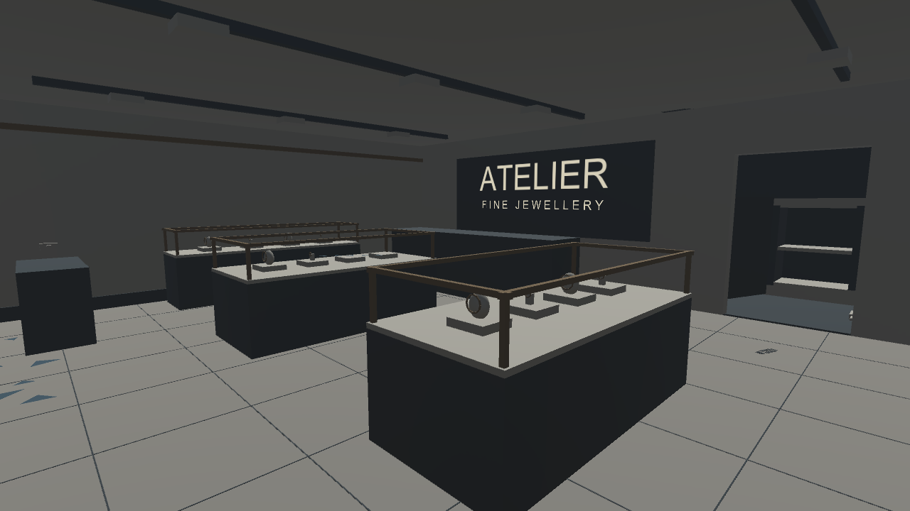
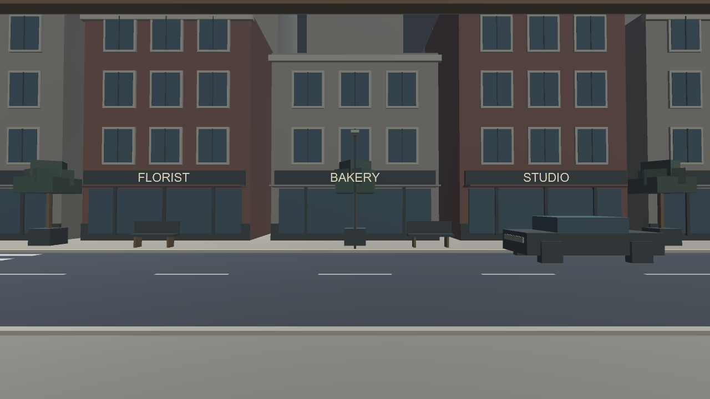
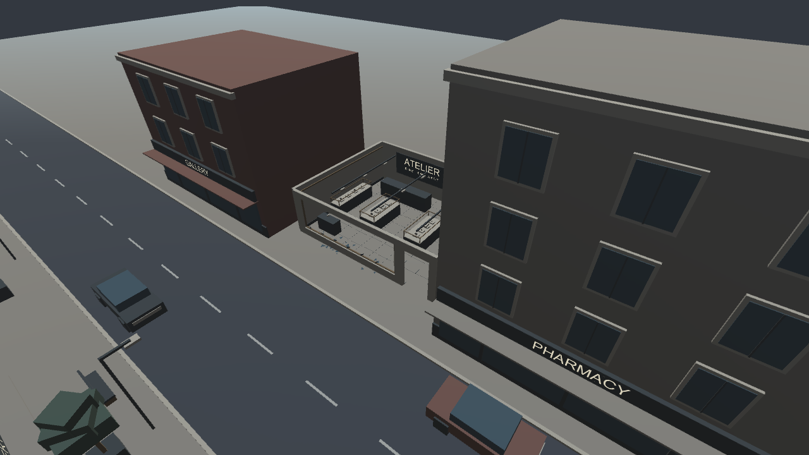

# Batch 03: refined shop, indoor walking and city backdrop

Verified October 8, 2026 on the Windows PC in Unity 6000.6.2f1, Built-in pipeline.

## Open the latest project

Download [the complete generated project snapshot](../Downloads/JewelryStore_City_Unity6000.6.2f1.zip). Extract into UnityProject next to the repository README, then run Open-Unity-Blockout.cmd.

Open **Assets/CrimeSceneDemo/Scenes/JewelryStoreCity.unity** and press Play.

- WASD or arrow keys: walk.
- Hold the right mouse button: look around.
- Release the right mouse button: use the desktop tool panel.
- Home: return to the inside starting position.
- Escape: release the mouse cursor.

The starting position is inside near the entrance. The showroom and safe room are accessible. A full-width invisible collider across the front window and doorway keeps the player inside, with the existing walls and a fallback position limit protecting the other edges. This is desktop controller behavior; future XR locomotion must use these boundaries and restrict teleport destinations to the interior. Physical headset movement has not yet been integrated or tested.

## Shop refinements

Shared flat-color materials, floor joints, dark display bases, brass-colored rails, wall trim, ceiling track-light geometry and ATELIER signage. Existing evidence, safe and tools remain. No texture packs, custom shaders or third-party assets were added.

## Street outside

Road, pavement, curbs, lane markings, crossing, opposite shopfronts, upper-floor windows, adjacent buildings, distant city blocks, parked cars, lamps, benches and planters.

The backdrop uses simple 3D geometry so the view remains consistent while moving around the shop. City mesh geometry is combined by shared material. Exterior geometry has no physics colliders, moving traffic, shadow casting or additional lights.

Measured generated backdrop:
- 4,740 mesh triangles (excluding font glyph geometry).
- 18 renderers, including 9 shop signs.
- No backdrop physics colliders.

These counts constrain the added complexity; they are not a headset frame-rate guarantee.

## Actual Unity captures

## Verification

All scripts compiled. **22 assertions passed in Editor Play mode**: nine checks for indoor spawn, movement, boundaries, safe-room access and backdrop budgets, plus the previous thirteen tool/tape/camera/reset checks. The saved runtime photo is also available in VerificationCity/runtime-photo.png.

Checks exercise the movement component and collisions programmatically. Physical keyboard/mouse input, headset controls and VR performance still need hands-on validation.

A first visual review identified overlapping pavement; that duplicate was removed and captures regenerated. The original verified scene remains available as JewelryStoreDemo.unity.

## Rebuild from source

Import all Prototype runtime and Editor scripts. In the isolated demo project, execute ShopCityValidation.Run through Unity's -executeMethod option. It generates the store, tool station and refined city, creates a desktop walker, saves JewelryStoreCity.unity, captures images, runs assertions and exits Unity.

The three new source files are ShopWalkController.cs, ShopCityRefinement.cs and ShopCityValidation.cs. The project snapshot includes their Unity .meta files and generated material/mesh references.

## Known setup limitation

Unity's Package Manager startup problem remains unresolved. The supplied launcher uses -noUpm for this package-free stage. Fix that issue before installing OpenXR/XR Interaction Toolkit. No standalone build or Quest test is claimed.
