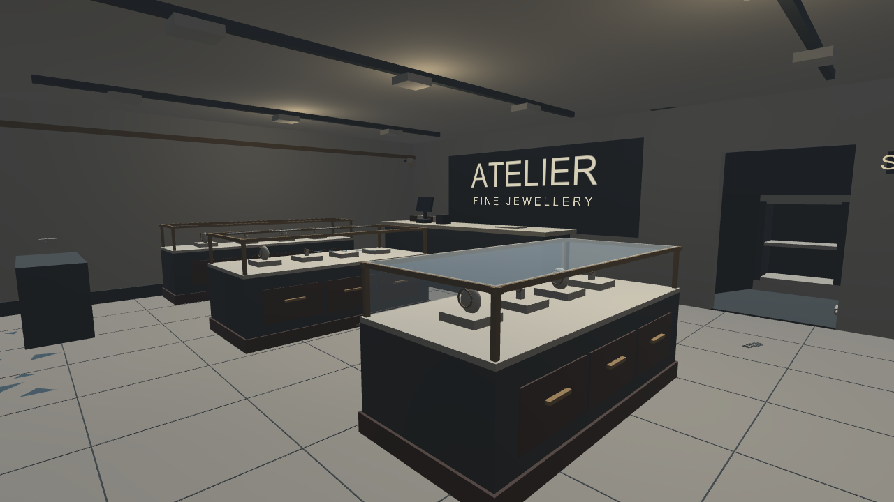
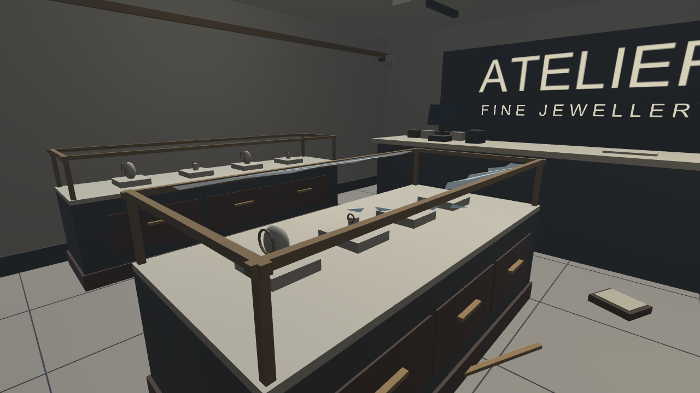
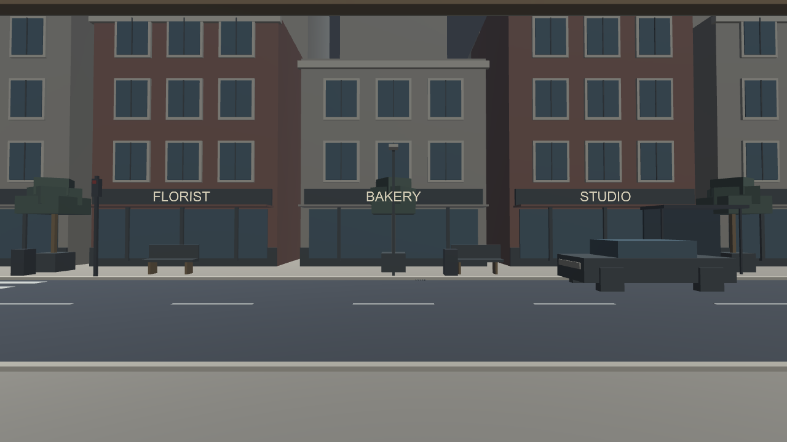

# Batch 04 — shop detail and desktop tool placement

Verified October 8, 2026 in Unity 6000.6.2f1, Built-in pipeline.

## Latest project

[Download the complete expanded Unity project](../Downloads/JewelryStore_Expanded_Unity6000.6.2f1.zip).

Extract into UnityProject next to the repository README, run Open-Unity-Blockout.cmd, and open **Assets/CrimeSceneDemo/Scenes/JewelryStoreExpanded.unity**. Press Play.

## Added shop detail

- Walnut-colored display fronts, drawer divisions, brass-colored handles and plinths.
- Intact and damaged display glazing, jagged storefront glass remnants and entrance framing.
- Countertop, payment terminal, receipt printer, ledger and gift boxes.
- CCTV and alarm props, staff sign, safe-room shelving and records.
- Dropped tray, fallen display trim and darkened safe-door-edge detail.
- Three warm point lights without shadows.
- Bus shelter, traffic signal props, litter bins and drain grilles outside.

These are lightweight procedural geometry and shared materials. No paid assets, downloaded art or texture packs were used. The new glass uses Unity's built-in Standard shader transparency; no custom shader was added.

## Desktop tool workflow

1. Spawn a cone, marker or tape post from the panel.
2. Choose **Place selected with mouse**.
3. Point at an accessible interior floor/display surface. A small green preview shows a valid target.
4. Left click to place. Q/E rotates in 15-degree steps; Escape cancels without moving the tool.
5. Select an existing tool by clicking it in the world or in the panel; reposition or remove it.
6. Connect two tape posts with the existing endpoint controls.

Cones are orange; markers and tape are yellow; marker labels have an assigned rendering font. The panel scrolls when its controls exceed the screen height.

Placement checks the first solid surface, rejects walls and exterior positions, and does not raycast through the front barrier. The preview does not validate training procedure or score any action.

## Movement and photography

WASD/arrows walk; hold right mouse to look; Home returns to the inside starting position.

**F** or **Photograph current view** saves the view you are looking at. The dedicated capture camera temporarily takes that pose, then restores it. The handheld camera's original CapturePhoto method remains available for future VR activation.

## Real Unity captures

## Verification

All scripts compiled and **33 assertions passed in Editor Play mode**. The previous indoor-boundary, city, tool, tape, photo and reset checks passed again after the changes. New checks cover:

- Point-placement component setup.
- Finding an interior floor surface and placing a marker on it.
- Exterior rejection, cancellation and storefront occlusion.
- Marker font assignment.
- Street-detail renderer budget and absence of exterior physics colliders.
- Current-view photo capture and restoration of the dedicated camera pose.

[Raw results](VerificationExpanded/runtime-results.txt).
The generated runtime photograph is at VerificationExpanded/runtime-photo.png.

The base city remains 4,740 mesh triangles and 18 renderers; new street props are combined into no more than six additional renderers. Three shadowless interior lights and a small number of transparent panes add rendering cost. Actual Quest performance is not yet measured.

These are programmatic Editor runtime checks. Hands-on keyboard/mouse usability, VR controls and a standalone player build remain unverified.

## Source and regeneration

New: DesktopToolPlacement.cs, ShopPresentationExpansion.cs and ShopPresentationValidation.cs.
Updated: EvidenceCamera.cs and DemoDesktopPanel.cs.

Use ShopPresentationValidation.Run only in this isolated demo project: it creates and saves the expanded scene, captures images, performs checks and exits Unity. The complete snapshot includes Unity .meta files, generated assets and ProjectSettings. Earlier snapshots remain available.

## Current blocker for VR

Unity Package Manager startup remains unresolved; the launcher uses -noUpm for this package-free prototype. OpenXR/XR Interaction Toolkit and Quest integration are still pending.
