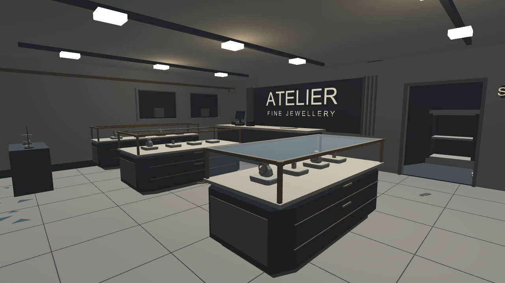
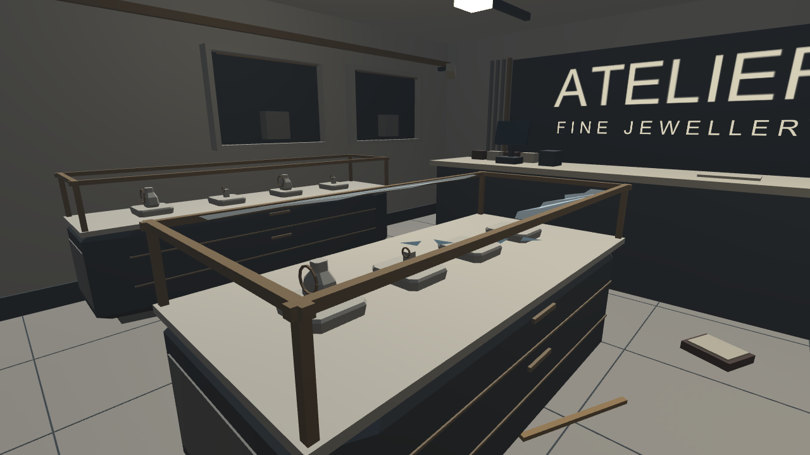
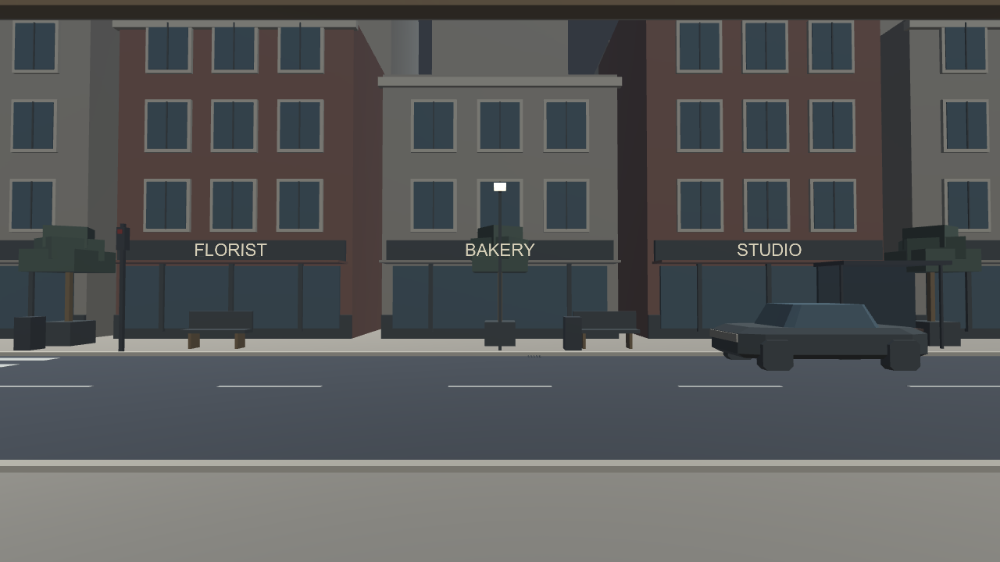

# Geometry forms — verified October 10, 2026

Unity 6000.6.2f1, Built-in pipeline, Windows PC. **72 automated Editor Play mode assertions passed**. [Raw results](VerificationForms/runtime-results.txt).

[Download the generated project](../Downloads/JewelryStore_Forms_Unity6000.6.2f1.zip). Extract into UnityProject_Forms beside the repository README and run Open-Unity-Forms.cmd. Open Assets/CrimeSceneDemo/Scenes/JewelryStoreForms.unity.

## Scene changes

Four cabinets now have chamfered corners, recessed toe-kicks, end panels, drawer reveals and pulls. Necklace mounts use shaped shoulder-and-neck meshes; display pads have beveled outlines. The intact-store overlay receives the same stock shapes.

Framed wall niches, branding borders/ribs, a safe-room door surround and a deeper storefront sill/header add depth. West niches leave room for the photograph frame. Parked cars have tapered bodies, sloping cabins and eight-sided wheels.

The Forms scene uses procedural city, lamp, tool and shop geometry. It skips the imported environment props and cone. No new texture maps, image generation, downloaded art, realtime lights or decorative colliders were added. Existing glass, text and runtime photographs remain functional.

## Actual Unity captures







## Measured budgets

| Group | Mesh triangles | Renderers |
|---|---:|---:|
| New shop form detail | 1,624 | 24 |
| City backdrop | 5,044 | 19 |

These are group counts, not a total-scene or FPS measurement. New opaque details are combined by material within each cabinet or wall zone. Interactive objects, colliders and intact/robbed state groups are not merged. No new shadow-casting lights.

The validator checks the new detail against a 5,000-triangle / 32-renderer cap and verifies no decorative colliders, lights, textures or transparent materials in that group. Existing city-budget checks also pass.

## Validation and integration fixes

All source compiled. Checks cover indoor spawn/walking/bounds, programmatic teleport/snap-turn, pointer placement, simulated hand grabbing and ownership, camera hand-off, mode switching, map, sound setup, intact/robbed switching, tape, photographs, review records and reset.

Fixed a shared validator variable-name collision. Synchronous grab tests now synchronize moved colliders before queries. Fixed two runtime issues exposed by the checks: the closest grabbable item wins across tools/samples/camera, and mode switching releases held items before disabling hands so the camera stays active on its rack.

Unity's known Editor SearchDatabase indexing exception still appeared; it did not prevent the validation run. Package Manager still requires -noUpm. Quest tracking, headset frame time, hands-on usability and a standalone build remain unverified. This is a tested Editor project, not a Windows executable.

## Regenerate

Use all current Prototype source together in an isolated Unity project, preserving matching .meta files and removing obsolete scripts. Run:

```text
Unity.exe -batchmode -noUpm -projectPath "<isolated project>" -executeMethod ShopCityValidation.RunForms -logFile "<log path>"
```

Do not add -quit: the validator exits after its Play mode checks. It generates the scene, registers it for builds and writes captures/results into Docs/VerificationForms alongside the project.

Crime Scene Demo > Refine Store Forms can apply the shop pass once to an expanded scene; it does not remove imported assets already present. Use RunForms for the complete procedural environment. Historical downloads remain available.
