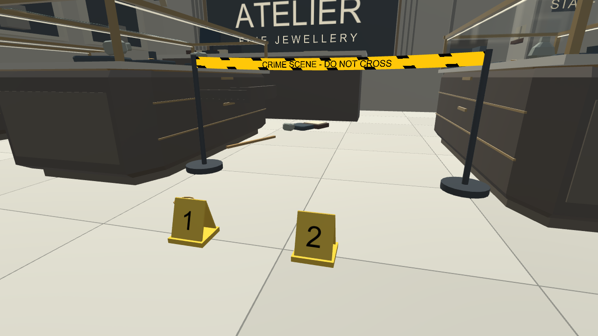
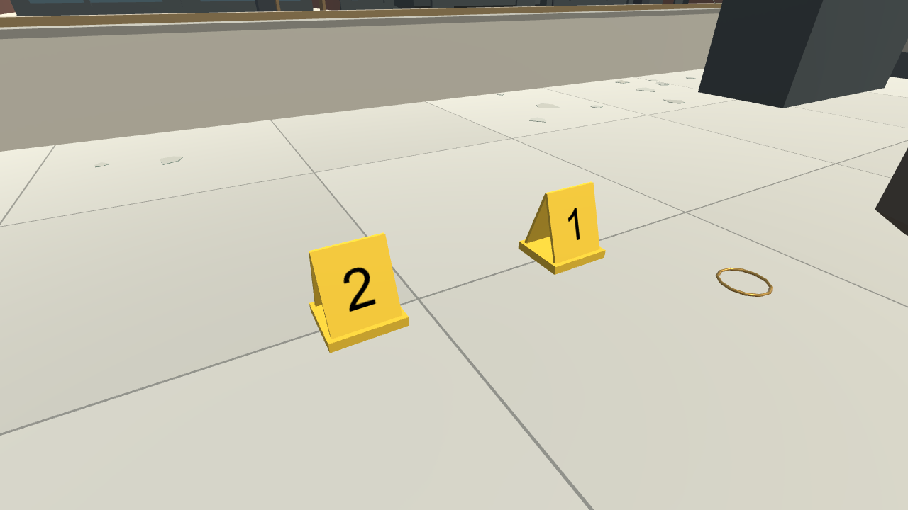
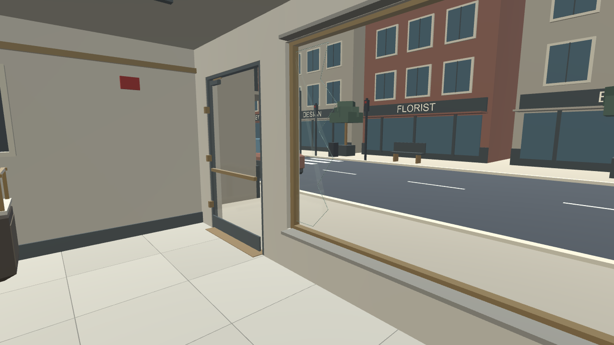

# Glass and tool correction pass

October 10, 2026. Unity 6000.6.2f1, Built-in pipeline.

## What changed

- Loose glass: all 32 fragments sit on the actual counter or floor surface. Smaller irregular pieces have 2 mm thickness and green edges. Counter fragments are scattered beside pads instead of floating across them. Floating sill triangles were removed.
- Glazing: clear panes, angle-dependent reflections, polished edges and outlined fracture boundaries replace the opaque blue look. A single static 256 x 256 cubemap captures the room once during generation. It is an approximation: moved tools and people will not appear in that reflection. No refraction or realtime reflection camera.
- Evidence markers: corrected A-frame panel angles; upright numbers on both faces; depth-tested number material is saved into the prefab, preventing the back number from showing through.
- Tape: placing a second post automatically connects it to the previous placed post. New posts extend the run. Moving a post updates its connected tape without adding duplicates. Ribbon geometry has a slight sag, striped borders and readable warning text.
- Removal: point at a tool and press **R** or **Delete**. Alternatively press **Tab**, find it under **Placed tools**, and click **Remove**. Removing a post also removes its connected tape immediately. In VR, grip a deployed tool then use B/Y to remove it.
- Tape controls: the panel can disable automatic connections or start a separate run. T still manually connects selected posts; X cancels manual selection. The first post alone has no ribbon until another is placed.

## Actual Unity captures

## Verification and performance limits

137 automated Editor Play mode assertions passed (138 PASS lines including completion). Ten scene captures were rendered and a runtime evidence photo was saved. Tests cover each fragment's support height, marker shape/orientation/material, pointer selection and deletion, automatic tape placement, moved endpoints, separate runs, shader compilation, reset, photo capture, indoor boundaries and simulated hand interactions. See [results](VerificationGlass/runtime-results.txt).

The active test scene reports 14,458 MeshFilter triangles and 323 mesh renderers, excluding text. These are geometry counts, not draw calls or measured FPS. Four shadowless lights remain. One RGB cubemap uses roughly 1.1 MiB of raw pixel data; no per-frame reflection render. Glass uses transparency, so overdraw still needs headset profiling. Tape updates its transforms/material parameters only when endpoints move.

Physical Quest 2 tracking/input, visual comfort, VR FPS and a standalone build are still unverified.

## Open or regenerate

[Download the project](../Downloads/JewelryStore_Glass_Unity6000.6.2f1.zip). Extract into **UnityProject_Glass** beside the repository README, run **Open-Unity-Glass.cmd**, then open **Assets/CrimeSceneDemo/Scenes/JewelryStoreGlass.unity**.

The same project is on the PC. Previous projects are preserved. Regenerate in an isolated project with **ShopCityValidation.RunGlass**, using the full Prototype/Scripts, Prototype/Editor and Prototype/Shaders folders. This runs the Interior and Robbery generation chain, then ShopGlassRefinement. The download includes generated materials, meshes, cubemap, prefabs, scene and .meta files.
