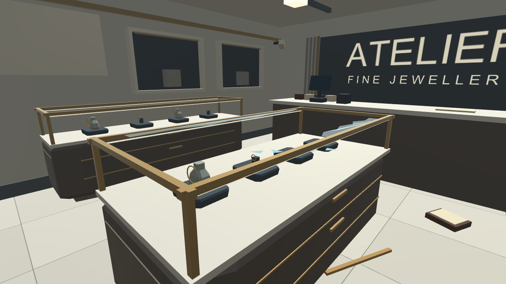
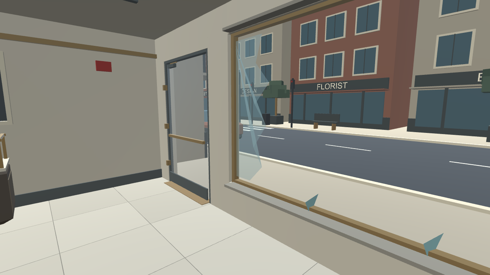
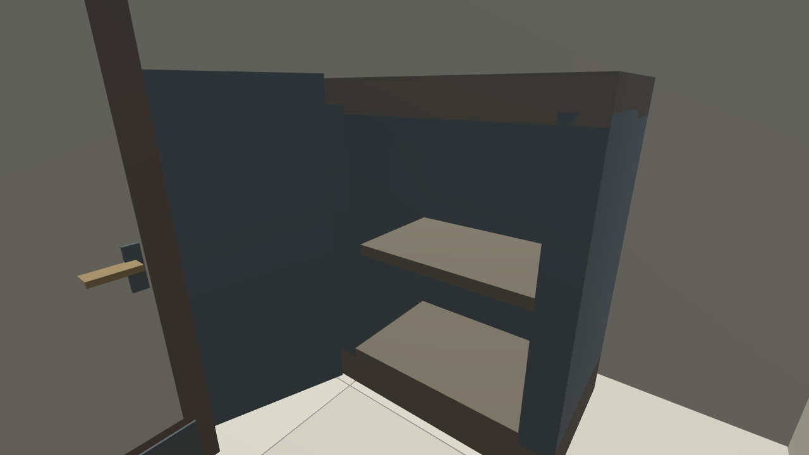

# Store interior — first finish pass

Verified October 10, 2026 on the user's Windows PC in Unity 6000.6.2f1, Built-in pipeline. **81 automated Editor Play mode checks passed.** [Raw results](VerificationInterior/runtime-results.txt).

[Download the Interior project](../Downloads/JewelryStore_Interior_Unity6000.6.2f1.zip). Extract into UnityProject_Interior beside README, launch Open-Unity-Interior.cmd, and open Assets/CrimeSceneDemo/Scenes/JewelryStoreInterior.unity.

## Work completed in the requested order

First: warm plaster walls, pale stone tiles with narrow grout and subtle color variation, ceiling paint, softer opal light fixtures, entrance hinges/closer/kickplate, and a fixed-open staff door with handles. The existing walking surfaces remain; the staff door adds one simple box collider. Safe-room access passed the movement checks.

Then: thin clear glass panes, distinct broken glass, warmer cabinet finishes, bronze frames, dark display pads and simplified gold jewelry loops. A tiny emissive strip sits under each case frame; these strips do not add lights. The intact/robbed toggle and damage evidence remain working.

This is a restrained material pass without texture maps, normal maps, reflection probes, screen-space effects or external art. Everything was built directly in Unity. There are four shadowless lights; the three local fill lights use vertex lighting. Headset frame rate is not yet measured.

## Actual Unity renders

## Cost

| Measured group | Triangles | Mesh renderers |
|---|---:|---:|
| New floor and door finish | 358 | 10 |
| Display diffuser strips | 96 | 1 |
| Existing form refinement | 1,624 | 24 |
| City backdrop | 5,044 | 19 |

Each jewelry loop is now one 96-triangle mesh instead of twelve box segments totaling 144 triangles. All 16 loops across both shop states were converted. Six glass surfaces now use four triangles each rather than transparent cubes. The door/case colliders remain simple.

The initial robbed scene reported 14,058 active MeshFilter triangles and 322 mesh renderers during validation, excluding text meshes. This is a scene-content count, not a measured draw-call count, peak load or FPS result.

A small depth-tested world-text shader fixes the street lettering that was visible through the store wall. It uses the existing font atlas, keeps it synchronized when Unity rebuilds it, and includes stereo/instancing macros. No new font textures were authored. Actual headset stereo rendering still needs verification.

## Validation

All source and the shader compiled; the scene was generated, saved, rendered and exercised in Play mode. The 81 checks include walking/bounds, safe-room access, programmatic teleport/snap turn, simulated hand interactions, camera transfer, intact/robbed state changes, tape, photos, reviews, reset, geometry budgets and finish setup.

The existing Unity Editor SearchDatabase indexing exception still appeared without preventing validation. Package Manager still needs -noUpm. Hands-on usability, actual Quest tracking/frame time and a standalone Windows build remain pending.

## Development handoff

ShopInteriorFinish handles the shell and lighting. ShopDisplayFinish handles cases, glass, jewelry and world labels. DepthTestedLabel keeps world labels on the current font atlas. WorldText.shader is under Prototype/Shaders: copy that directory into Assets/CrimeSceneDemo/Shaders along with the Editor and Scripts source.

Run ShopCityValidation.RunInterior with -executeMethod in an isolated project. It creates JewelryStoreInterior.unity, registers it for builds, writes six scene captures and a runtime photograph under Docs/VerificationInterior, runs the checks, then exits. Do not add -quit.

The PC project is UnityProject_Interior. Prior Forms/Review projects and ZIPs remain available.
