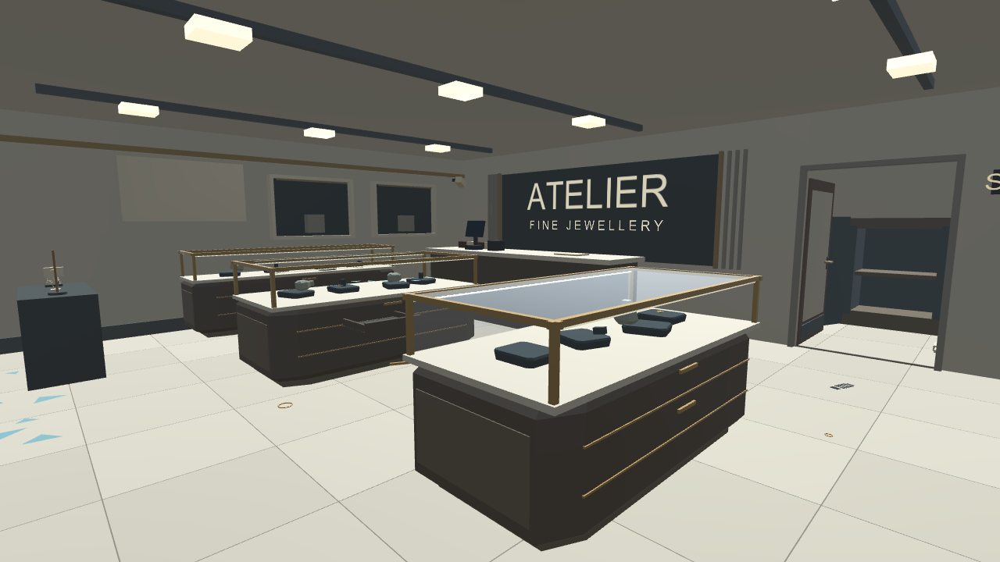
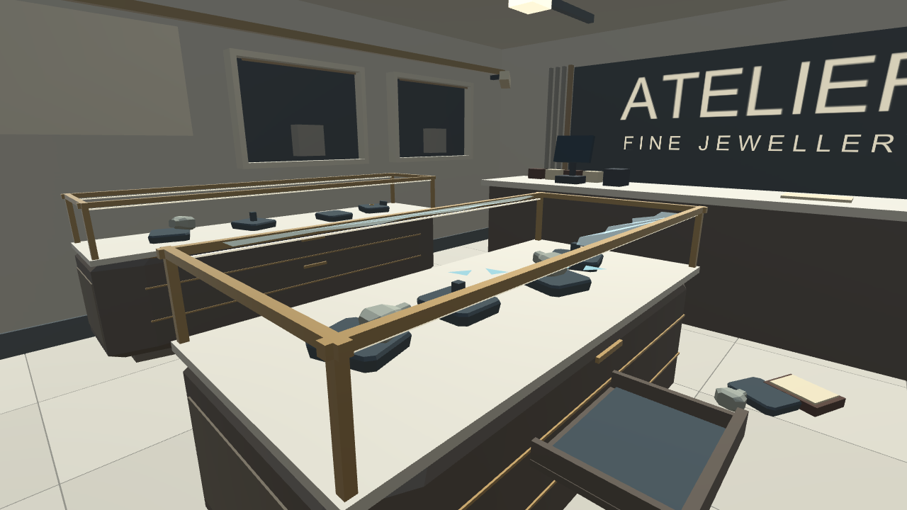
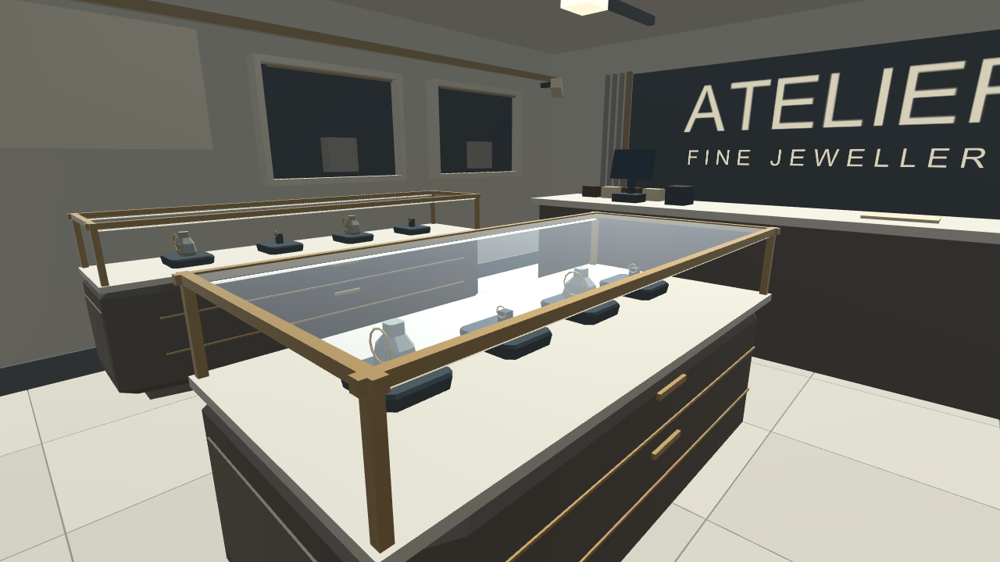

# Robbery scene and desktop controls
October 10, 2026 — Unity 6000.6.2f1, Built-in pipeline.

The presenter panel now starts closed. Tab opens it; walking and desktop tool shortcuts pause while it is open. Right click toggles mouse look, Escape releases the cursor. A small control hint remains visible. A tool cannot be placed at its stale previous position when aiming at an invalid surface. The overview camera only updates while its panel is visible.

The robbed shop has 16 empty/disturbed pads, upright empty stands, overturned stands, a fallen bust and pad, an open empty tray, three remaining jewels and two dropped pieces. Intact mode restores all original tidy stock; reset returns the robbed layout. Decorative debris adds no colliders or physics bodies. The tray has thin walls and a recessed dark insert, using the existing finish materials. Walls, floor, doors, glass and lighting retain the previous lightweight material pass.

Validation: 92 PASS lines including the completion marker, in automated Editor Play mode. Source compiled, seven scene captures rendered, runtime photo saved, placement/reset/hand simulation and walking boundaries checked. See [full results](VerificationRobbery/runtime-results.txt).

Robbery dressing: 1,908 triangles. Active scene: 13,494 mesh triangles and 321 mesh renderers, excluding text; renderer counts are not draw calls. Four shadowless lights. No new texture maps or realtime lights.

Real Quest tracking, headset FPS, subjective control feel and a standalone build remain unverified. The desktop controls have changed; this is not a claim of tested physical VR input.

Download [the Unity project](../Downloads/JewelryStore_Robbery_Unity6000.6.2f1.zip), extract into UnityProject_Robbery beside the repository README, then run Open-Unity-Robbery.cmd. Open Assets/CrimeSceneDemo/Scenes/JewelryStoreRobbery.unity.
