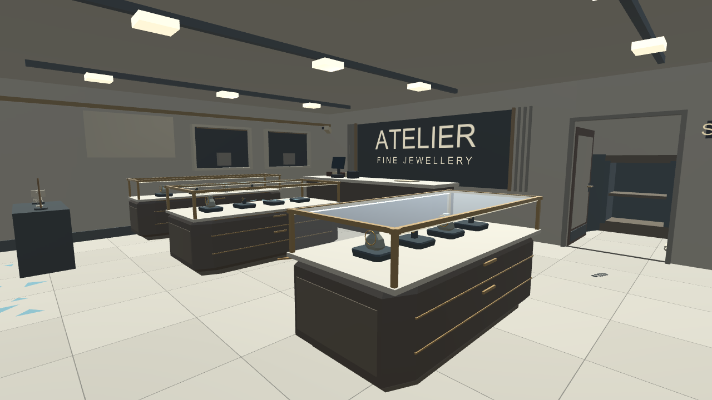
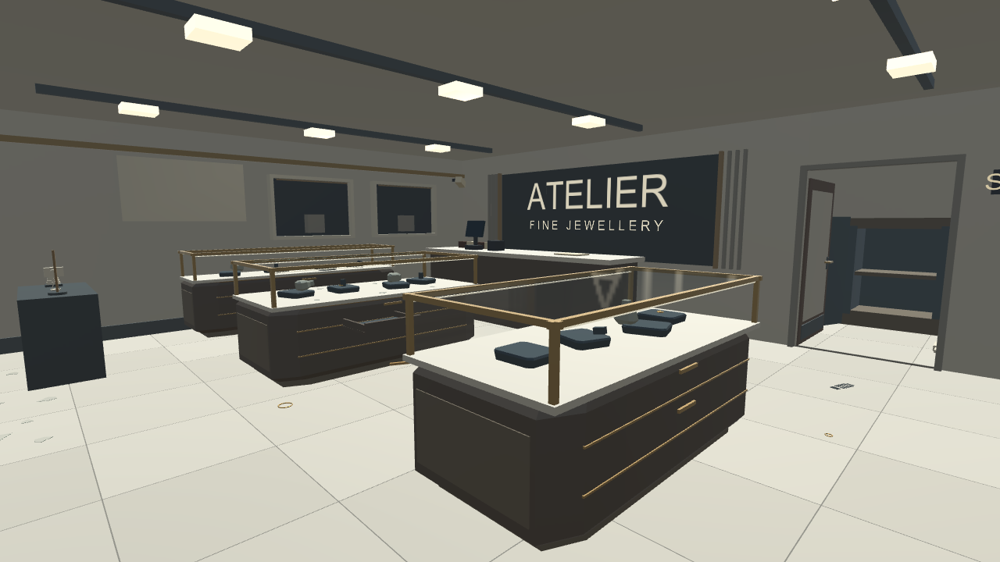
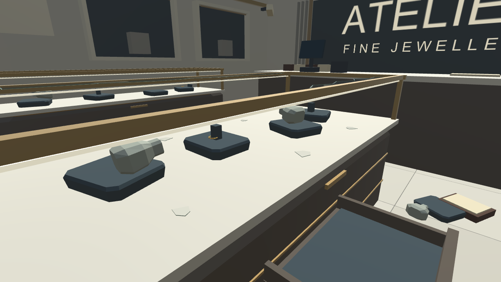

# Store asset review and render comparison

Reviewed GitHub revision a2a6564d83b6faf1adbfb5ed7cfeedae35d439a2 on October 10, 2026.

## Status

Remote Desktop Commander reported no connected devices. No Unity compilation, new rendering, scene modification or PC synchronization was possible in this review. The newer source and assets are explicitly marked unverified in HANDOFF.md. The screenshots below are historical Unity renders, not renders of the new texture/assets batch.

Review focused on ShopTextureFinish, ShopAssetDressing, DemoAssetLibrary, the generation/validation chain, asset register, three actual albedo images and four candidate furniture meshes. This is not a complete audit of the new UI, photo, lighting and VR features.

## Store material direction

Keep the existing warm stone / dark walnut / muted brass palette.
- Pale stone: suitable for the showroom, but the provided StoneTiles image has heavy dark grout. Reduce grout width/contrast before the finish pass.
- Plaster: candidate for warm walls; inspect the normal-map intensity in headset before acceptance.
- Walnut: the supplied image has conspicuous regular dark stripes. Reduce grain contrast and check scale and direction on cabinet fronts; do not apply unchanged to every surface.
- Marble: the supplied image is pale with fine looping veins. Use sparingly on counters/display tops so evidence stays easy to see.
- Brushed brass: candidate for frames and door hardware. Keep reflectivity restrained.
- Scanned parquet: optional back-office floor, not necessary for the main showroom.
- Keep the existing custom glass rendering as the starting point; regenerate its static reflection after accepted interior changes.

## Candidate props

OBJ geometry inspected directly (triangles counted by triangulating face sizes; Unity import still unverified):

| KayKit Furniture asset | Triangles | Proposed use |
|---|---:|---|
| lamp_standing | 320 | One rear-corner lamp |
| pictureframe_standing_A | 74 | One restrained counter frame |
| table_low | 276 | Optional seating area, only if routes stay clear |
| cabinet_medium_decorated | 1,018 | Back office storage |

The asset register records these as CC0. Use a small consistent selection rather than placing every available prop. Check actual imported scale, pivots, collision and clearance in Unity. The current combined dressing also includes Khronos furniture and decorative items with varying visual styles and licenses; their presence in the repository does not mean they all belong in this store.

## Findings before integration

1. **Confirmed validation mismatch:** ShopAssetDressing.Count is 22, but Apply contains 22 counted Place calls plus the separately counted rug = 23 objects when all files exist. ExpansionChecks compares childCount against Count, so a fully populated scene will fail that check. Correct the count or curate the placement list and its expectation together.
2. **Scope mismatch:** RunTextured enables imported assets globally. ShopTextureFinish.Apply textures city materials and calls Environment(), which replaces sky/reflections and camera clear modes. Add an explicit store-only path before using it for the current request.
3. **Persistence check needed:** TileByWorldSize stores tiling in MaterialPropertyBlock. These blocks are not serialized as scene data; verify tiling after save/reopen and Play mode reload. Persist/reapply the per-renderer values or use durable UV/material settings.
4. **Visual verification needed:** Per-renderer tiling uses the two largest world bounds extents, not a face-specific UV mapping. Check grain direction and stretching on rotated and combined cabinet/trim meshes.
5. **No new validation claim:** Prior 137 passing assertions apply to the older Glass milestone. They do not establish that the 14 newer commits compile or render correctly.

## Same-view historical comparison

Earlier interior finish, before the robbed-stock and glass corrections:

Latest previously verified Glass milestone, with disturbed stock and clearer glazing:

Additional close-up from that verified milestone:

## Next connected-PC pass

Create an isolated project from current source/assets, preserve the previous scene, implement store-only material application, curate the furniture, resolve the count/persistence issues, compile and run relevant checks, then capture the same showroom and display camera positions before and after. Leave street, sky and unrelated gameplay work outside that pass.
