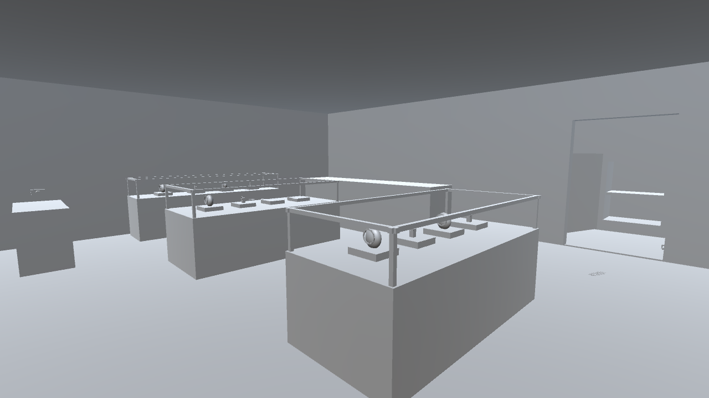
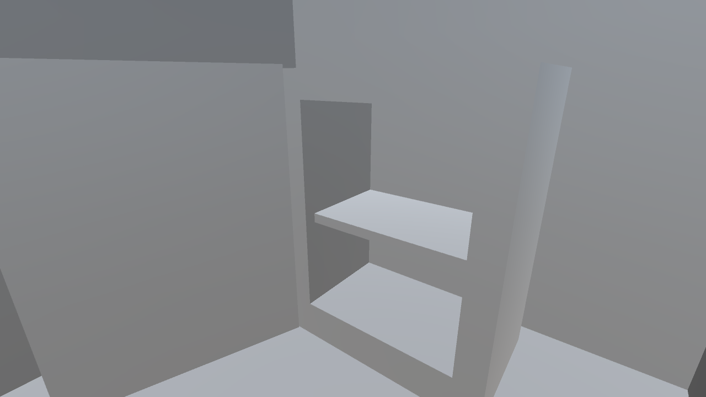
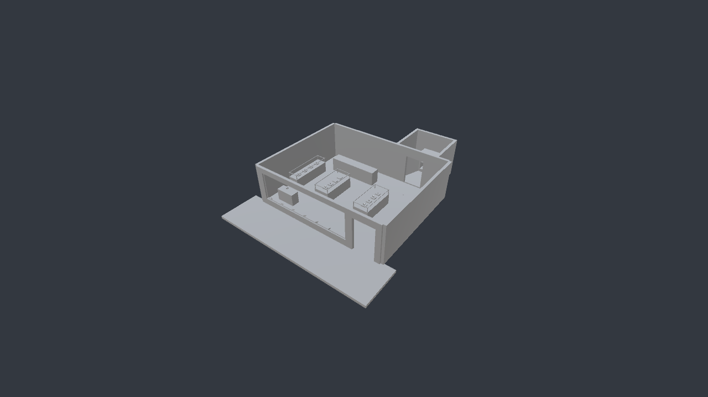
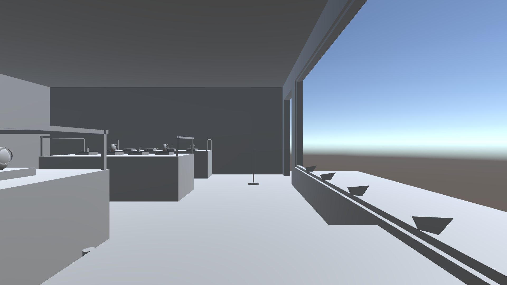

# PC verification — October 8, 2026 (UTC)

## Confirmed

Actual execution on the user's Windows PC using Unity **6000.6.2f1**, Built-in Render Pipeline and Direct3D 12. Unity reported NVIDIA GeForce RTX 5060 Ti and approximately 16 GB RAM.

All 21 original downloaded repository files matched GitHub blob hashes before the tested camera modification. The prototype source and project copy were then synchronized for that change.

All source compiled. Store/tool generators created and saved a real Unity scene. Thirteen runtime assertions passed in Unity Editor Play mode:

- Tool station exists.
- Sequential marker numbers.
- Marker label text assigned.
- Tool placement.
- Tape connection.
- Correct tape length.
- Tape follows moved endpoint.
- Tape disappears after endpoint removal.
- Runtime camera saves a photograph.
- Reset clears deployed objects.
- Reset restarts marker numbering.
- Reset preserves photographs.
- Reset restores handheld camera position.

This is Editor runtime verification, not a standalone Windows build or Quest test. Number-label readability, folder-opening UI, shutter audibility, locomotion, XR grabbing and headset performance still require direct checks.

## Actual captures

These are rendered by Unity, not concept art.






Ceilings were temporarily hidden for the layout capture, then restored in the saved scene. Gray geometry and default materials are intentional.

## Camera change

Replaced WaitForEndOfFrame with callbacks that confirm the dedicated camera rendered before reading pixels. Built-in Camera.onPostRender and SRP endCameraRendering are supported entry points; only the Built-in pipeline was tested here. Capture reports a timeout rather than waiting indefinitely.

## Project location on the PC

`C:\Users\MOBPC\Documents\Codex\Jewelry-store-vr-demo\Jewelry-store-vr-demo-main\UnityProject`

Scene: `Assets/CrimeSceneDemo/Scenes/JewelryStoreDemo.unity`.

The parent folder contains create/validation logs. Captures and assertion results are in Docs/Verification.

## Downloadable project

[Verified project snapshot](../Downloads/JewelryStore_Unity6000.6.2f1.zip) contains Assets, generated meshes/prefabs, scene, source and .meta files, plus ProjectSettings. It excludes Library, caches and user settings. It has no XR packages.

Extract into a folder named UnityProject alongside the repository's README. Use Open-Unity-Blockout.cmd from the repository root, or the command below with your own project path.

```powershell
& 'C:\Program Files\Unity\Hub\Editor\6000.6.2f1\Editor\Unity.exe' -noUpm -projectPath 'YOUR_PROJECT_PATH'
```

The validation script is included. It runs only when explicitly invoked through its executeMethod; normal project opening will not start its checks or exit Unity.

## Setup issue still open

Normal project creation failed because Unity's Package Manager local server did not start. A **-noUpm** launch allowed a package-free project to compile and run. No security settings were changed. Package Manager must be restored before XR packages can be installed; this workaround is only for the current geometry/core-tool stage.

Unity also logged an Editor Search indexing ArgumentOutOfRangeException. It did not prevent saved scene generation or the passing runtime assertions. Neither installation issue is marked resolved.

## Reproduction

With Unity closed and this project's sources imported, launch Unity with -batchmode -noUpm -projectPath PATH -executeMethod JewelrySceneValidation.Run -logFile LOGPATH. The validator replaces the current scene with a new generated scene, captures images, enters Play mode, records assertions and exits with a success/failure code. Use only this isolated demo project.
